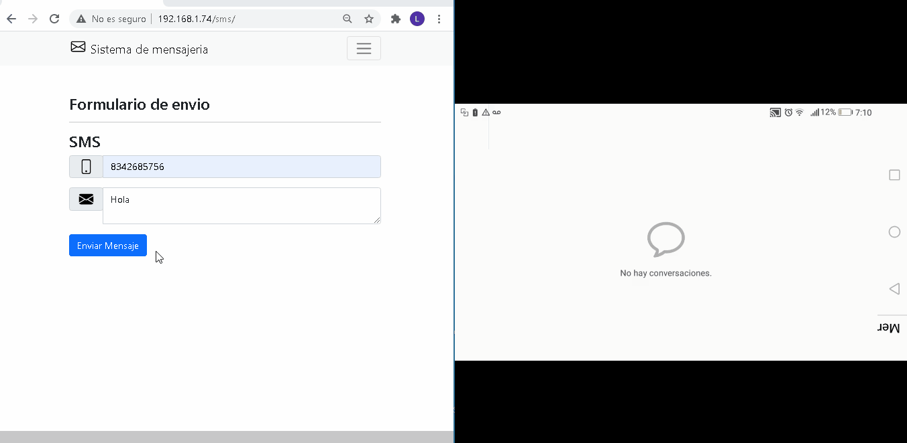
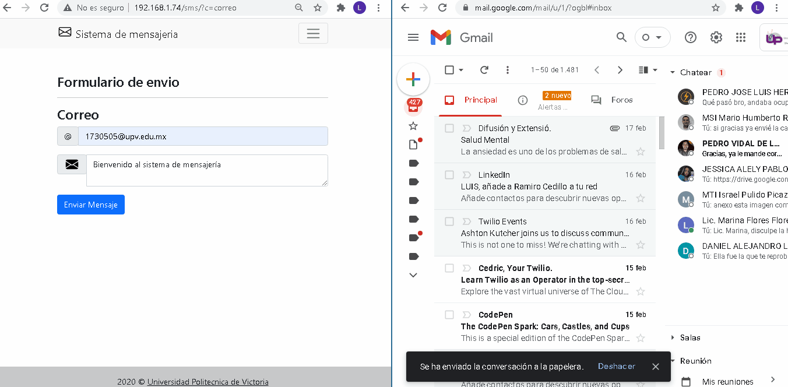
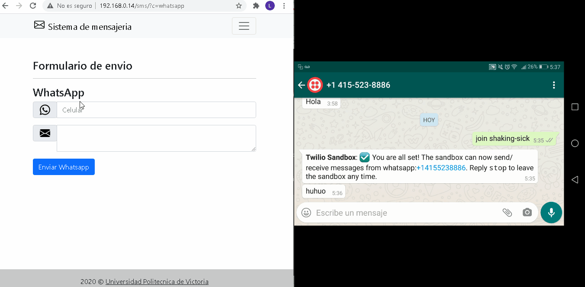

# Estancias II
<div>
    <br/>
    <p align="center">
        <a href="www.upvictoria.edu.mx/" target="_blank">
            
        </a>
    </p>
    <br>
    <div>
        <p align="center">Implementar <a href="#" >Mensajeria en un sistema de informacion</a> web transaccional</p>
    </div>
    <div>
        <p align="center">
            <a href="https://www.php.net/" target="_blank">PHP</a> | <a href="https://es.wikipedia.org/wiki/Modelo%E2%80%93vista%E2%80%93controlador" target="_blank">MVC</a>
        </p>
    </div>
</div>

## Funciones
- Enviar mensajes SMS
- Enviar correos Electrónicos
- Enviar mensajería por WhatsApp
- Enviar mensajeria via Facebook
- Publicar en perfil de Facebook

## Requerimiento
Desarrollar un algoritmo en el lenguaje de programación “PHP”, 
El cual es interpretado por un servidor apache utilizado en el back-end. 
Cuya funcionalidad principal sea la de notificar vía mensajes “SMS” 
para los clientes de una base de datos usando una librería en general y “Correo” usando la librería open source “PHPMailer”, 
mediante un host, deberá comunicar al servidor de correos usando el protocolo 
smtp (Simple Mail Transfer Protocol o Protocolo para Transferencia Simple de Correo) 
la dirección de un mail para los clientes de la base de datos.
"Facebook" deberá poder enviar mensajes vía Facebook Messenger además de publicar nuevas publicaciones.

## Librerías
- PHPMAILER
- TWILIO
- API Facebook

## Instalación

#### Paso 1
```
    Agregar las librerias PHPMailer a la raiz del proyecto
    y las agregamos con el comando.
```
- Agregar librerías
```php
    //LIBRERIA TWILIO
    require 'Twilio/autoload.php';
    //PHPMailer
    require 'PHPMailer/PHPMailer.php';
    require 'PHPMailer/SMTP.php';
    require 'PHPMailer/Exception.php';
    require 'PHPMailer/OAuth.php';
```

#### Paso 2
```
    Colocar las clases correo, sms, whatsapp.
    A la carpeta model del proyecto
```
#### Paso 3: Enviar correo
 - 1 -.Generamos una instancia de la clase
```PHP
    $send = new Correo('HOST');
```

- 2 -.Asignamos nuestro correo de salida
```PHP
    $send->set_Email(Mi_Email);
```

- 3 -.Asignamos nuestra password 
```PHP
    $send->set_Password(Mi_Password);
```

- 4 -.Creamos un mensaje
```PHP
    $send->messenger(Mi_asunto, Mi_Body, My_AltBody);
```

- 5 -.Agregamos un destino
```PHP
    $send->set_recipient(Destino);
```

- 6 -.Enviamos el correo
```PHP
    $send->Enviar();
```

#### Paso 4: Enviar SMS
 - 1 -.Generamos una instancia de la clase
```php
    $sms = new Sms();
```

- 2 -.Asignamos nuestro Numero de Twilio
```php
    $sms->setNum_Company(Num_Company_Twilio);
```

- 3 -.Asignamos nuestra Cuenta de Twilio 
```php
    $sms->set_ACOUNT_SID(ACOUNT_SID_Twilio);
```

- 4 -.Asignamos nuestro token
```php
    $sms->set_AUTH_TOKEN(AUTH_TOKEN_Twilio);
```

- 5 -.Asignamos un destino
```php
    $sms->set_Telefono(Lada_del_pais, Numero_destino, Mensaje);
```

- 6 -.Comprobamos el mensaje
```php
    $sms->ValidarEnvio(true or false);
```

#### Paso 5: Enviar WhatsApp
- 1 -.Generamos una instancia de la clase
```php
    $mensaje = new Whatsapp();
```

- 2 -.Asignamos nuestro Numero de Twilio
```php
    $mensaje->setNum_Company(Num_Company_Twilio_Whatsapp);
```

- 3 -.Asignamos nuestra Cuenta de Twilio 
```php
    $mensaje->set_ACOUNT_SID(ACOUNT_SID_Twilio);
```

- 4 -.Asignamos nuestro token
```php
    $mensaje->set_AUTH_TOKEN(AUTH_TOKEN_Twilio);
```

- 5 -.Asignamos un destino
```php
    $mensaje->set_Telefono(Lada_del_pais, Numero_destino, Mensaje);
```

- 6 -.Comprobamos el mensaje
```php
    $mensaje->ValidarEnvio(true or false);
```


## Capturas

Ejemplo Envio SMS
<hr>


<hr>

Ejemplo Correo
<hr>


<hr>
Ejemplo WhatsApp
<hr>


<hr>

## Acerca de:
Este proyecto es propuesto por [MSI. Jose Fidencio Lopez Luna]() y fue escrito por [Luis Gerardo Perales Torres](https://github.com/GitLuisG)
